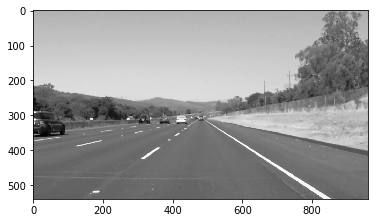
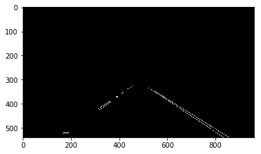
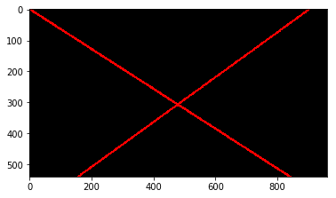
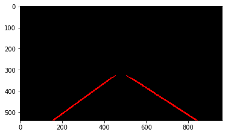
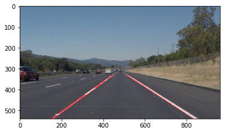

# **Finding Lane Lines on the Road** 

Overview
---

When we drive, we use our eyes to decide where to go.  The lines on the road that show us where the lanes are act as our constant reference for where to steer the vehicle.  Naturally, one of the first things we would like to do in developing a self-driving car is to automatically detect lane lines using an algorithm.

In this project you will detect lane lines in images using Python and OpenCV.  OpenCV means "Open-Source Computer Vision", which is a package that has many useful tools for analyzing images.  

## 1. Description of pipeline

The pipeline is given as follow:

(1) transform the RGB image into gray image

(2) include Gaussian smoothing with gaussian_blur function for suppressing noise and spurious gradients by averaging

(3) detect edges with canny function

(4) get the region of interest (ROI) of edges with a quadrilateral region mask

(5) use Hough transform to find lane lines in the ROI area

(6) separate line segments by their slope to decide which segments are part of the left line and which segments are part of the the right line

(7) reduce noise by get rid of horizental lines, which abs(slope) is < 0.4)

(8) fit the left lane and the right lane use np.polyfit(y,x,1) function to extrapolate to the top and bottom of the lane

(9) draw the lanes in region of interest and combine the found lanes with oringal image

The test image outputs are also in "test_images_output" Folder.

## 2. Potential shortcomings

(1) the parameters for canny edges detection and the choice of region of interest and the parameters for Hough transform are depending on the car direction and road conditions. So this pipeline can only work well under this specific data.

(2) the separation of left and right is only depending on the slopes of line segements. The influence of outliers of line segements have not been eliminated.

## 3. Possible improvements
(1) realize the automatically adjustment of parameters above mentioned.

(2) get rid of outlier of line segements.

(3) apply more efficient lanes separation methods.

(4) inability to capture curves on the road
